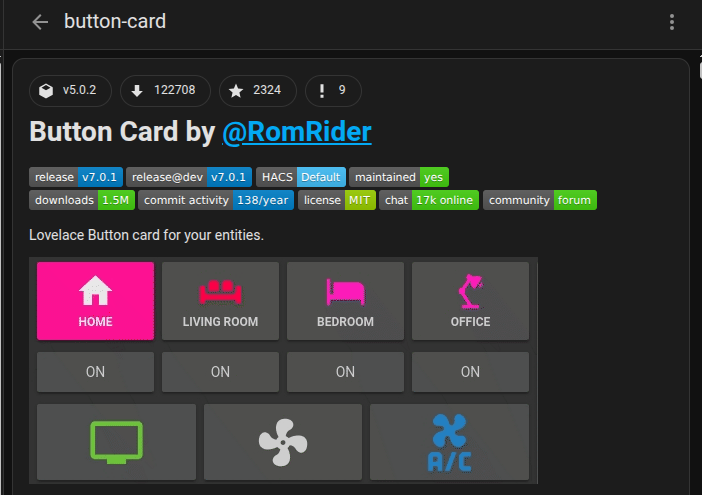
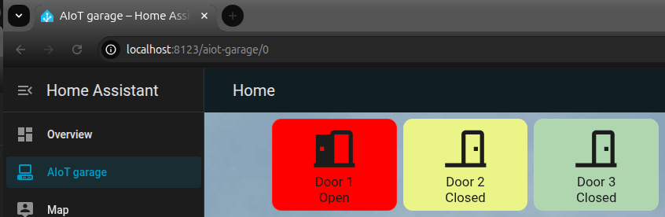

# Button Card

## Step 1

click edit dashboard and then click Add card. After that, select Manual.

## Step 2

Add the following configuration

**Note:** button-card must be downloaded from HACS. By default, it's not available. Refer HACS instructions if HACS is not installed.

More details 👉 https://github.com/custom-cards/button-card
~~~

type: custom:button-card 
entity: binary_sensor.t1_1_contact
name: Door 1
show_state: true
color_type: card
state:
  - value: "on"
    color: red
  - value: "off"
    color: "#C3B0D6"

~~~

You can find colour codes here 👉 https://htmlcolorcodes.com/

**Entity:**

you can get this from: 

**settings-> Devices & services -> devices -> click on the device -> settings -> Entity ID**

**Note:** If you want to add more sensors to the same card, click the + icon on the right-hand corner

Final look 👇

[⬅️ Back to Home Assistant Documentaion](home_assistant.md)
