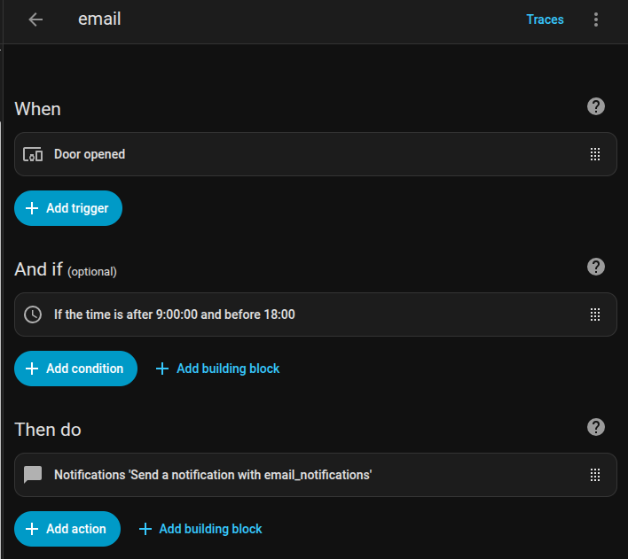

# Send a notification as an email

Modify the Home Assistant configuration.yaml

~~~
# Email notifications
notify:
  - name: email_notifications
    platform: smtp
    server: smtp.gmail.com
    port: 587
    timeout: 15
    encryption: starttls
    sender: sender gmail here
    username: gmail here
    password: !secret gmail_password
    recipient:
      - receiver1
      - receiver2
      # Here receiver doesnt need to be gmail. It can be any mail address

~~~

Note: We have to save the password in the secret.yaml file. Follow the instructions below.

Go to google accoount and generate an app password. Copy that password and paste it to secret.yaml

~~~
gmail_password: "app password here"
~~~

Now restart the Homeassistant container.

Now lets set up an automation to get an email if an event triggered.

~~~
Settings -> Automations -> create automation
~~~

You can use the UI or yaml file to set the automation

~~~
alias: email
description: ""
triggers:
  - type: opened
    device_id: e4c6c45304871cca73db2d6a90071c7a
    entity_id: 5bbc3de134a33c3f25e7c4ffa69e116a
    domain: binary_sensor
    trigger: device
    for:
      hours: 0
      minutes: 0
      seconds: 1
conditions:
  - condition: time
    after: "9:00:00"
    before: "18:00:00"
actions:
  - action: notify.email_notifications
    metadata: {}
    data:
      message: Door is opened
mode: single
~~~

If you use UI then you can select the device. But for yaml you need the device id. You can get it from the zigbee2mqtt web interface if it is a zigbee device.

[⬅️ Back to Home Assistant Automations](automations.md)