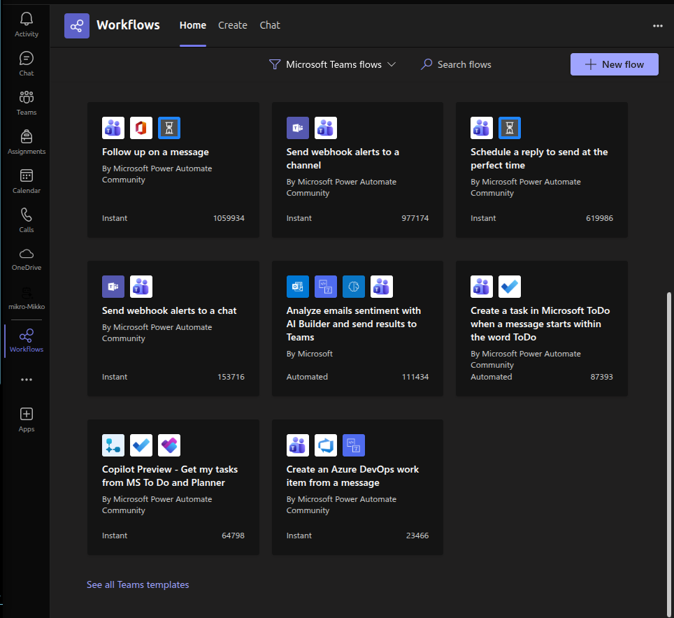
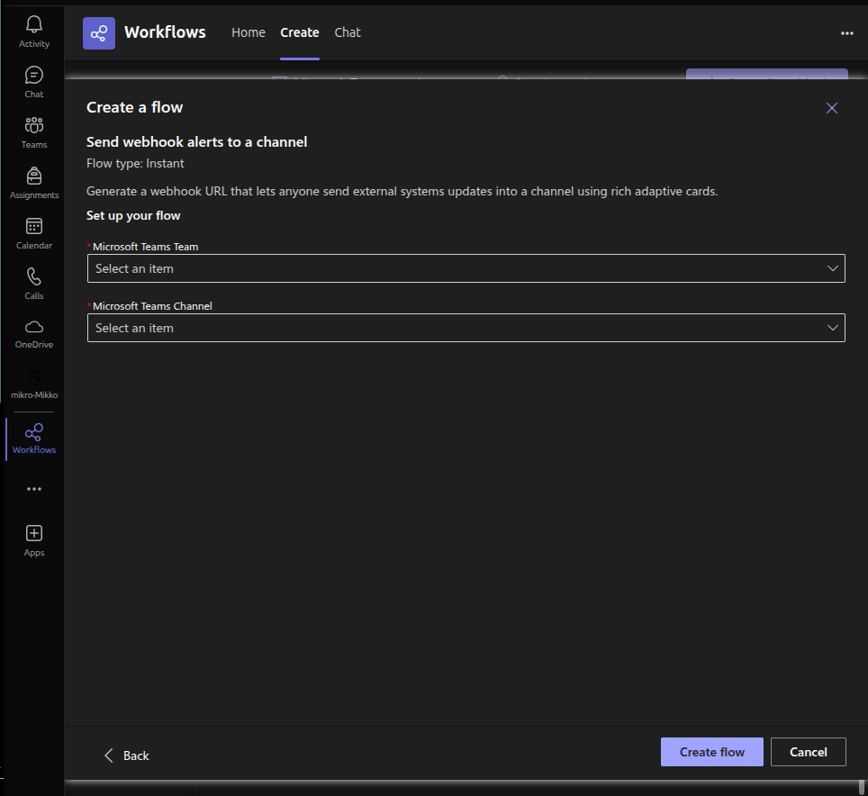
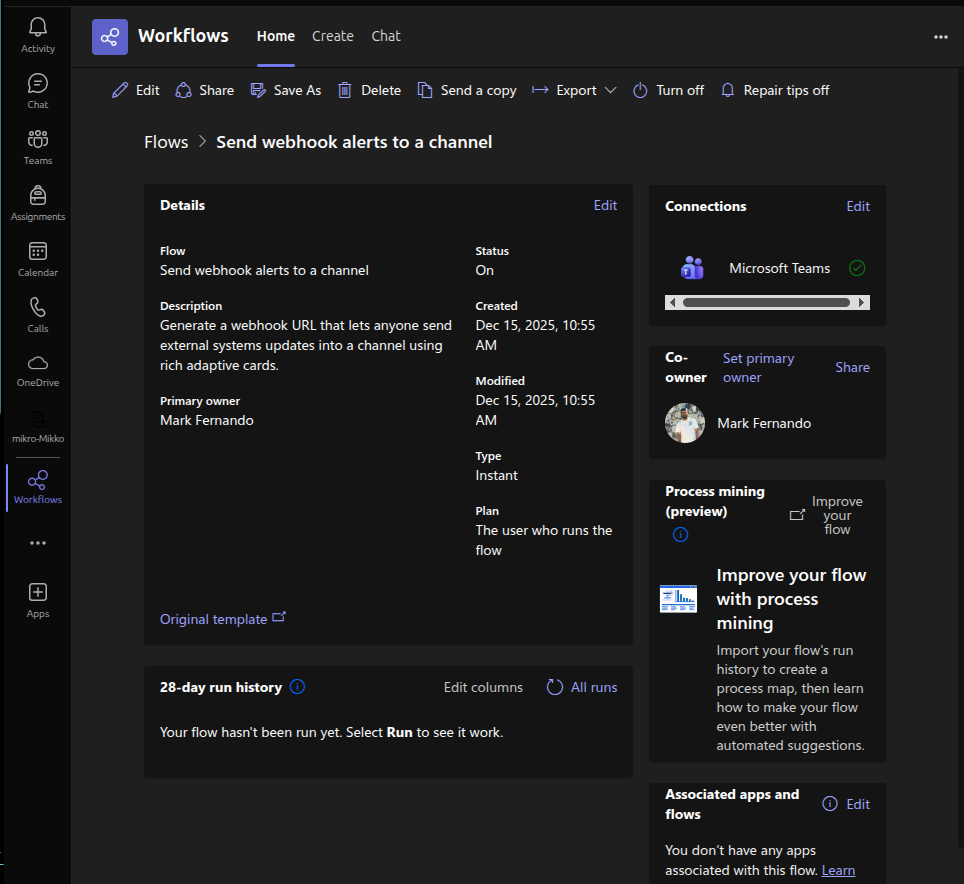
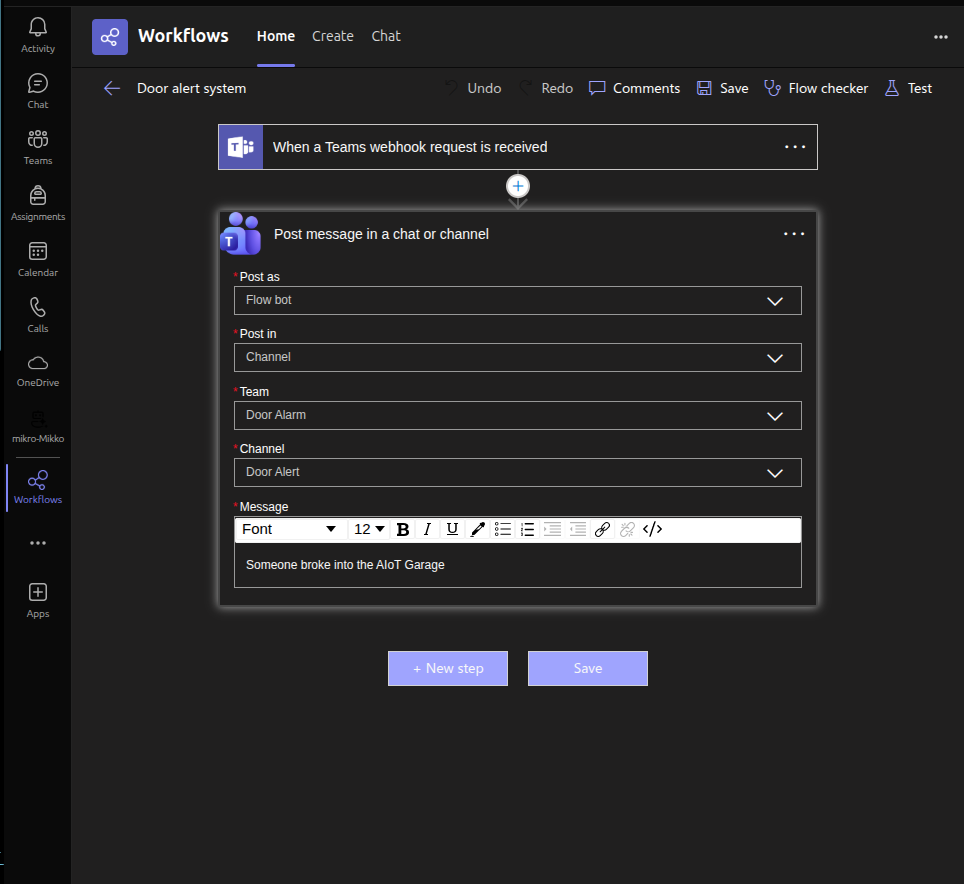
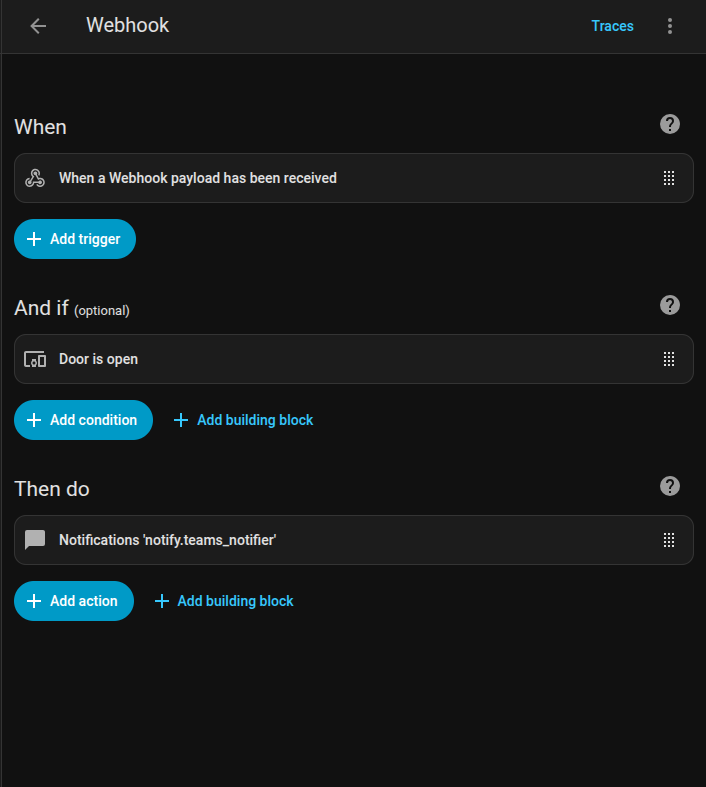

# Teams Notifications

First, you need a **Microsoft account**. Go to **Teams** and download **Workflows**.

In workflows, select **Send webhook alerts to a chat**.

Select your account and click next.

Select **Teams** and the desired channel.

This will create a url. Copy it and paste it into the secret.yaml

~~~
teams_webhook_url: "url here"
~~~

Add the following block to your configuration.yaml

~~~
rest_command:
  send_teams_notification:
    url: !secret teams_webhook_url
    method: POST
    content_type: 'application/json'
~~~

Restart the home assistant container.

Now, go to **Workflow home**. You will see the workflow that you created. 

Click **Edit**.

Edit the **Post message** settings for the chat or chanenel, and finally click save.

[⬅️ Back to Home Assistant Automations](automations.md)