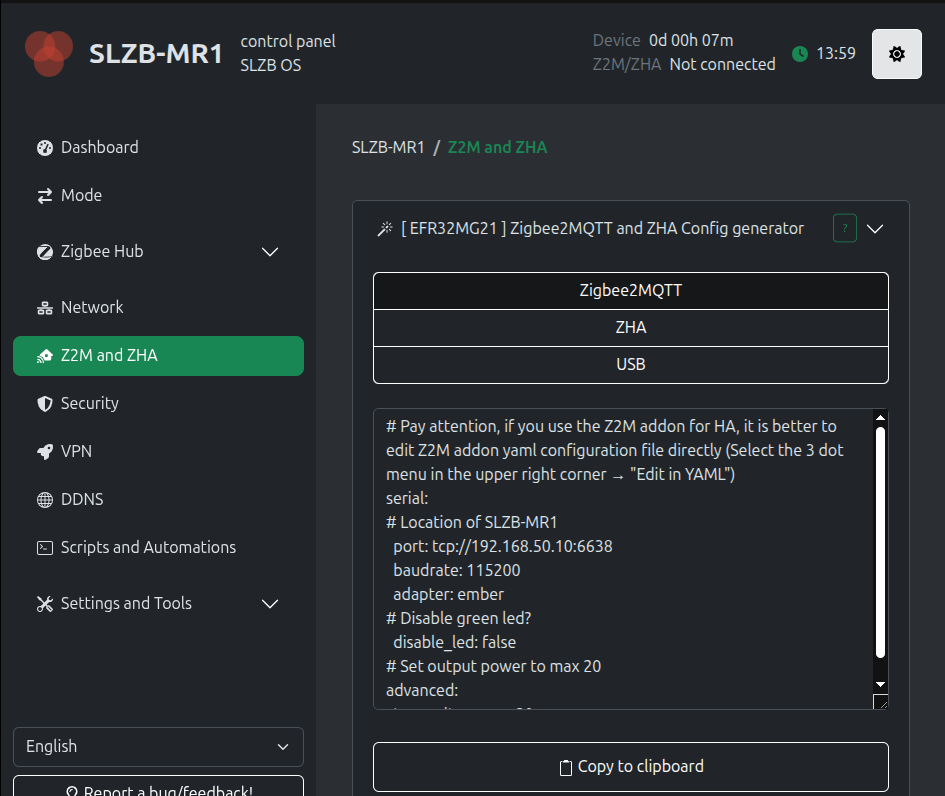
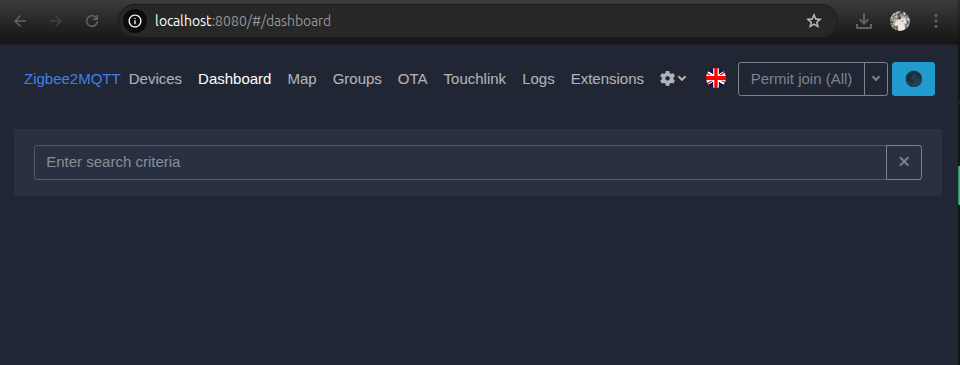
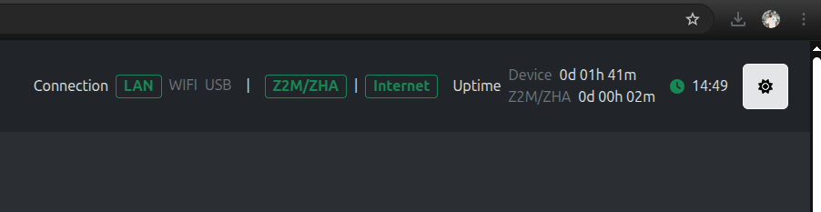

# Zigbee2MQTT configuration

## Installing MQTT

First we need to add mqtt in Home Assistant

Settings --> Devices & Services --> add integration --> mqtt 

## Installing Zigbee2MQTT

- Create a folder for zigbee in the root directory. 
- cd into it and run this. 

~~~
docker run \
   --name zigbee2mqtt \
   --restart=unless-stopped \
   -p 8080:8080 \
   -v $(pwd)/data:/app/data \
   -v /run/udev:/run/udev:ro \
   -e TZ=Europe/Helsinki \
   ghcr.io/koenkk/zigbee2mqtt
~~~

After this, your folder structure should look like this

~~~
├── ESPHome
│   ├── docker-compose.yml
│   └── esphome
├── home-assistant
│   ├── Dockerfile
│   ├── config
│   ├── docker-compose.yml
│   └── mosquitto
└── zigbee2mqtt
    ├── data
    └── docker-compose.yml
~~~

Next, run Docker Compose.

~~~
docker compose up -d zigbee2mqtt

~~~

Onboarding is now available in **port 8080**.

**Fill in the coordinator information**.
~~~
Coordinator/Adapter Port/Path: 

Coordinator/Adaptertype/Stack/Driver: 

Coordinator/Adapter Braudtrate: 
~~~

You can get this information from the coordinator web interface.

**Configure MQTT**

Tick Frontend enabled and Home Assistant enabled, others you can leave as it is.

Once evrything is set up, you should see the zigbee2mqtt web interface. 

Note: If you configured to use the latest z2m version, the interface may look slightly different.

Finally, verify that z2m is enabled in the coordinator web interface.

[⬅️ Back to Home](../../README.md)