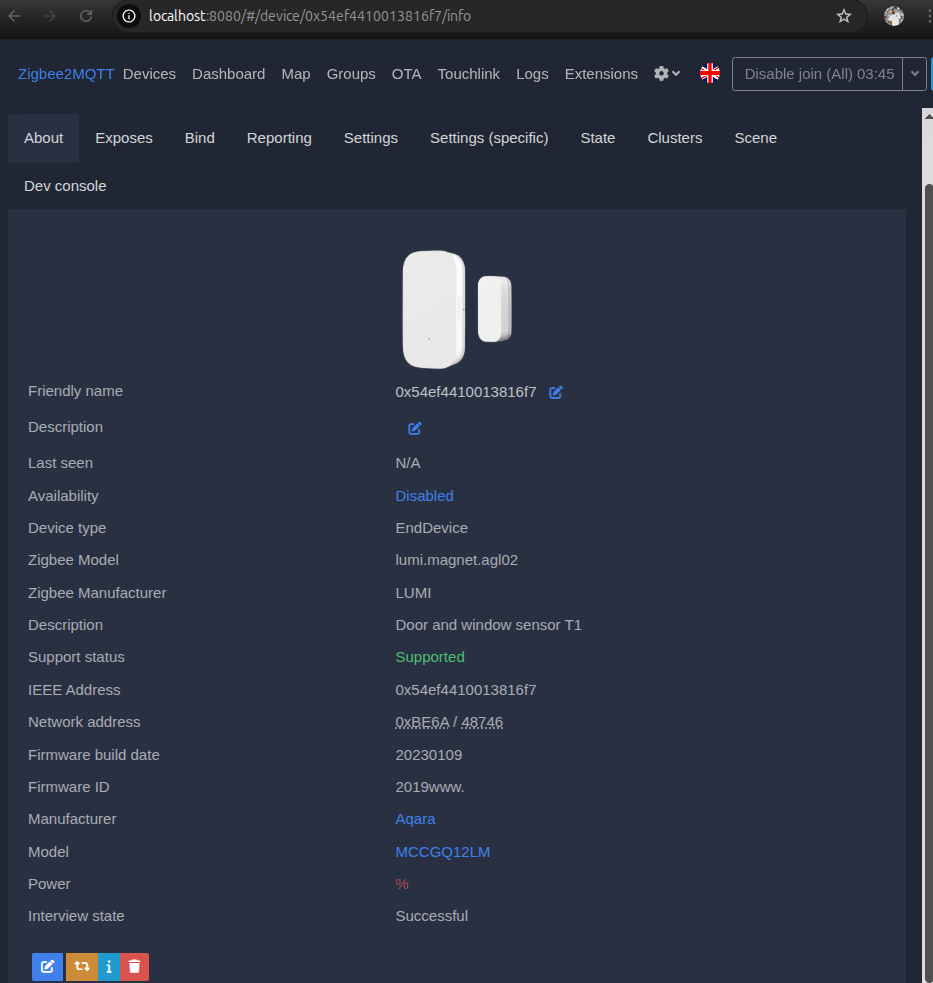
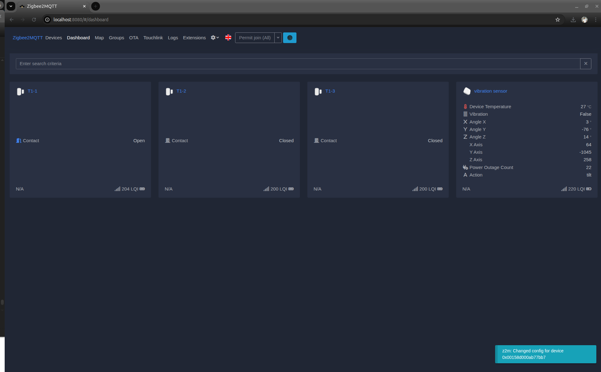

# Zigbee Sensors

## Aqara Door/window sensors

- Click **Permit join** in zigbee2mqtt web interface (This allows sensors to be added)
- Press and hold the button on the sensor.
- Newly discovered sensors will appear on web interface. Modify the details as needed.

## Aqara Vibration sensor

- Click on **Permit join** in zigbee2mqtt web interface
- Press and hold the button on the sensor

Note: Vibration sensor requires Aqara Hub. Full funtionality isn't available with the Home Assistant

Final look after adding all sensors👇

[⬅️ Back to Home Assistant Documentaion](home_assistant.md)