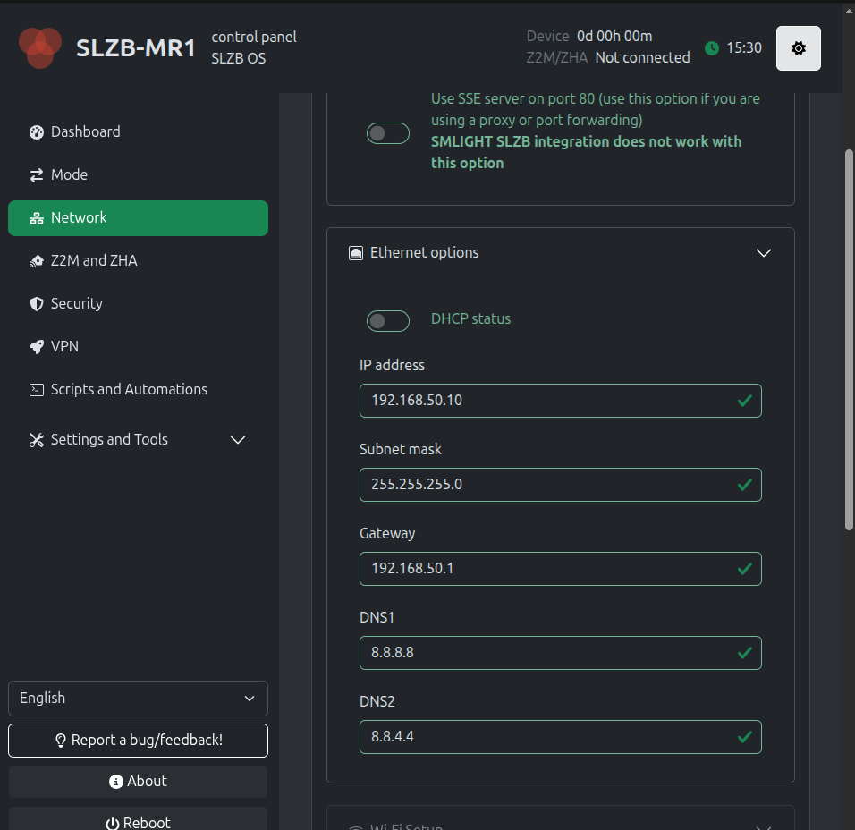
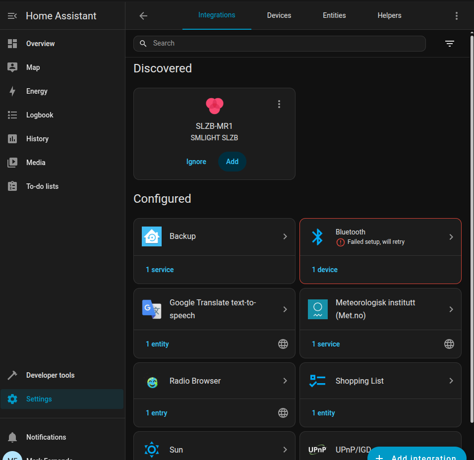
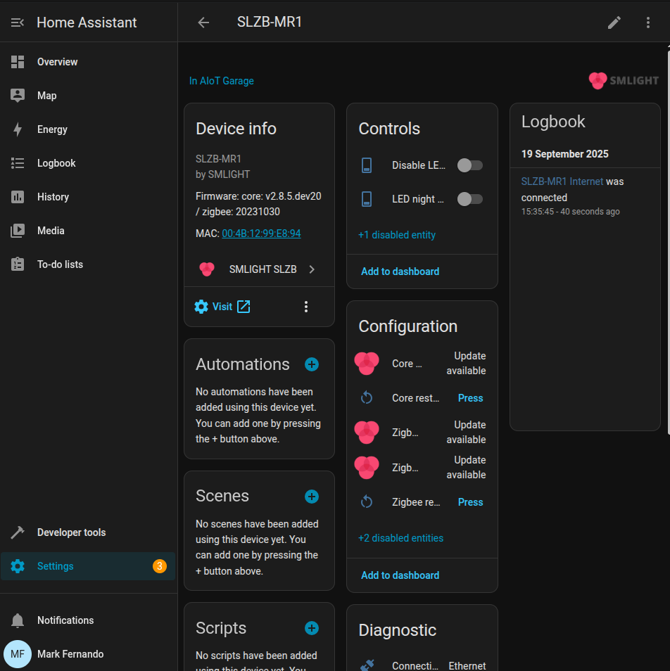

# Zigbee Coordinator Configuration (SLZB-MR1)

1. **Power and Network Connection**
   - Connect the SLZB-MR1 to power.  
   - Connect it to your Wi-Fi router using an **Ethernet cable**

2. **Find and Assign IP**
   - Open your router’s web interface.
   - Look for **connected devices** and find the entry for the SLZB-MR1.    
   - Reserve a Static IP.

3. **Access the MR1 Web Interface**
   - In your browser, go to `http://<MR1_IP>` 
   - The MR1 configuration page will open.  
   - From there, you can adjust:
     - Network settings (Ethernet/Wi-Fi)
     - Firmware updates, etc.

**Note:** If you dont see the coordinator in the Home Assistant double check you add the network settings on the SLZB-MR1 web page.

Network -> Add ip address, subnetmask and gateway

You should see the coordinator in the Home Assistant

Once you add it displays like this

# Issues

If you face issues when switching between modes or fail to download the firmware, try downloading and installing the firmware manually using the link below.
**Note:** You need to connect the coordinator to your laptop.

https://smlight.tech/flasher/#SLZB-06 

# Official links 

Product Details: https://smlight.tech/product/slzb-mr1

Manual: https://smlight.tech/manual/slzb-06/guide/installation/

[⬅️ Back to Home](../../README.md)